# ⚡ Octocat The Architect ⚡

  <b>Cyber-Architect & Autonomous Systems</b>

  
  
  
  

---

<!-- CYBER_PROFILE_START -->
<!-- Dual Terminal Workspace: ASCII Portrait & Neofetch Side-by-Side -->
<table border="0" cellpadding="0" cellspacing="0" width="100%">
  <tr>
    <td width="50%" align="center" valign="top">
      
    </td>
    <td width="50%" align="center" valign="top">
      
    </td>
  </tr>
</table>

 

<!-- GitHub Contribution Calendar: Slant Reveal & Specular Glow -->

  

<!-- CYBER_PROFILE_END -->

---

### 🌐 Transmission Channels

  
  &nbsp;
  
  &nbsp;
  

